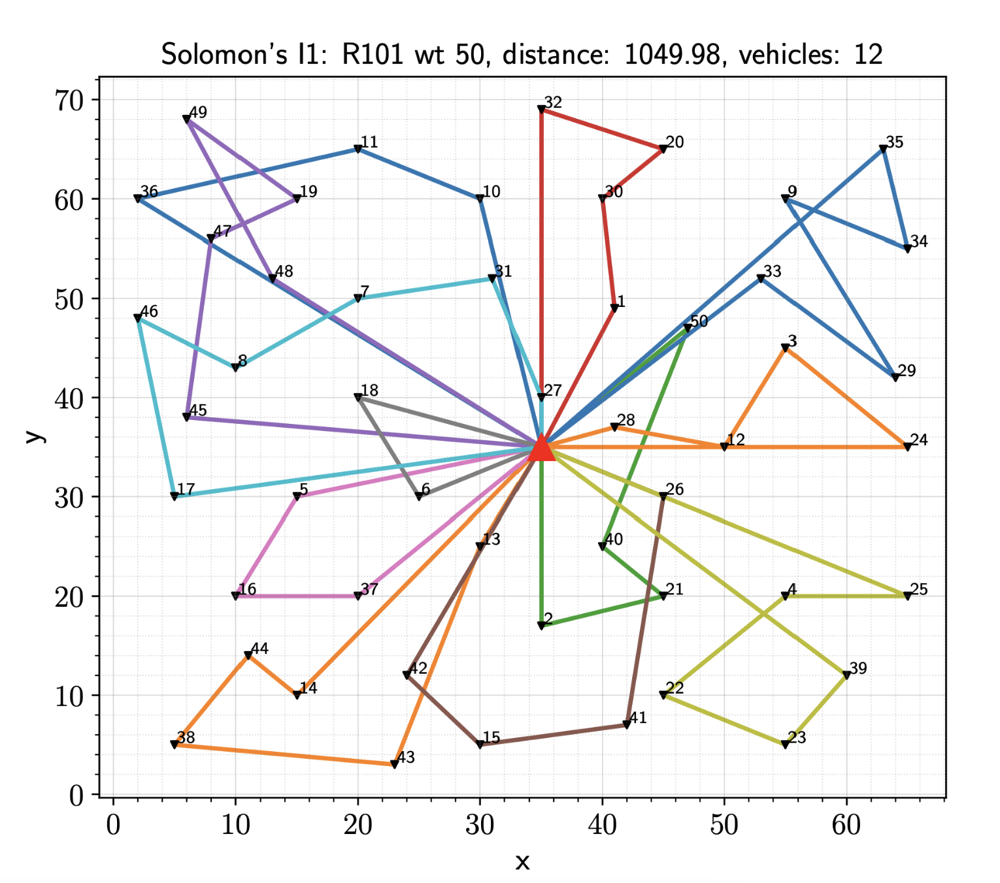

# Vehicle Routing Problem with Time Windows (VRPTW)

This repository contains implementations of heuristic and exact solutions for the Vehicle Routing Problem with Time Windows (VRPTW). The heuristics implemented are Solomon's Insertion, Clarke-Wright Savings (CWS), and Sweep. The exact solution uses the SCIP solver.

## Requirements

The project was developed using Python 3.10. The required packages are listed in the `requirements.txt` file. To install them, run the following command:
```bash
pip install -r requirements.txt
```

## Results

The results of the experiments are stored in the `results` and `figures` folder. Comparable results are shown in the notebook in `./area51/viz.ipynb`.

<a href="figures/insertion.png"></a>

## Usage

Run a single file or multiple files with the heuristic solutions by running the following command:

```bash
python3 ./src/insertion.py --files R101 C101 RC101 --customers 50 --iterations 10
```
```bash
python3 ./src/cws.py --files R101 C101 RC101 --customers 50 --iterations 10
```
```bash
python3 ./src/sweep.py --files R101 C101 RC101 --customers 50 --iterations 10
```

Run a single file or multiple files with the exact solution by running the following command:

```bash
python3 ./src/exact.py --files R101 C101 RC101 --customers 50 --large_constant 10000 --workers 8 --time 10
```

Arguments has the following meaning:
- `--files`: List of files to be processed.
- `--customers`: Number of customers to be considered.
- `--iterations`: Number of iterations to be executed.
- `--large_constant`: Large constant to be used in the exact solution.
- `--workers`: Number of workers to be used in the exact solution.
- `--time`: Time limit to be used in the exact solution (in minutes).

Reproduce the results of the project by running the following command:
```bash
bash experiments.sh
```
Here is the content of the `experiments.sh` file:
```bash
#!/bin/bash

CUSTOMERS=50
ITERATIONS=10
LARGE_CONSTANT=10000

FILES=("R101" "R102" "R103" "R104" "R105" "C101" "C102" "C103" "C104" "C105" "RC101" "RC102" "RC103" "RC104" "RC105")

echo "Running heuristic solution..."
python3 ./src/insertion.py --files "${FILES[@]}" --customers $CUSTOMERS --iterations $ITERATIONS

echo "Running heuristic solution..."
python3 ./src/cws.py --files "${FILES[@]}" --customers $CUSTOMERS --iterations $ITERATIONS

echo "Running heuristic solution..."
python3 ./src/sweep.py --files "${FILES[@]}" --customers $CUSTOMERS --iterations $ITERATIONS

echo "Running exact solution..."
python3 ./src/exact.py --files "${FILES[@]}" --customers $CUSTOMERS --large_constant $LARGE_CONSTANT

echo "All tasks completed."
```